# How to get your Light Wallet Private Key

## Introduction
I have always wanted to be able to automate my light wallet addresses. 
But I was not able to calculate my private key using a mnemonic seed.

In a Defichain Telegram group, a way to extract his private key was shown. 

I would like to document this way transparently for everyone!

.. note:: 

    This method is based on the Saiive Wallet, which is a community funded project.
    Unfortunately, this project will be discontinued at the end of 2022. 
    This should not affect the functionality of extracting the private key.

.. warning:: 
    
    This method is also designed to generate a new mnemonic seed, 
    because there have been some errors when entering an existing mnemonic seed. 

## Requirements
- you have to download the [Saiive Wallet](https://www.saiive.live/)
- Paper and Pen :)

## Best practice
- Retrieve your private keys only if you really need them
- make sure your device is not compromised
- write down the mnemonic seed phase on a piece of paper and put it in a secure place
- you can also turn off your Internet connection

## Getting the private key

### 1. Start Saiive Wallet and click on "Create a new wallet"
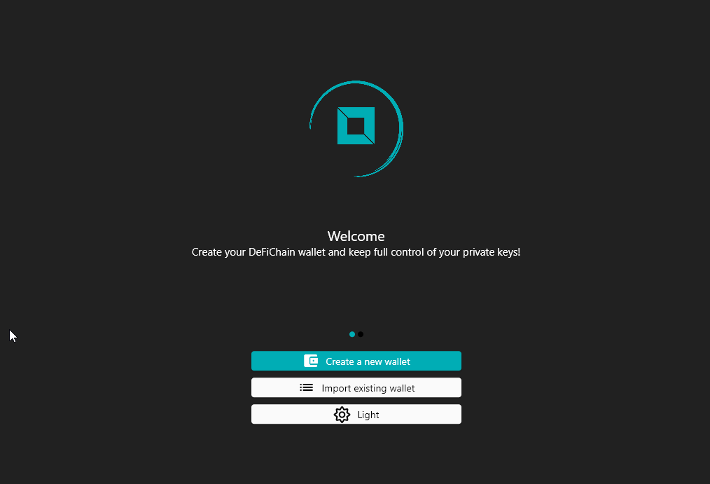

### 2. You have to agree to "Terms of Service" and "Private Notice"
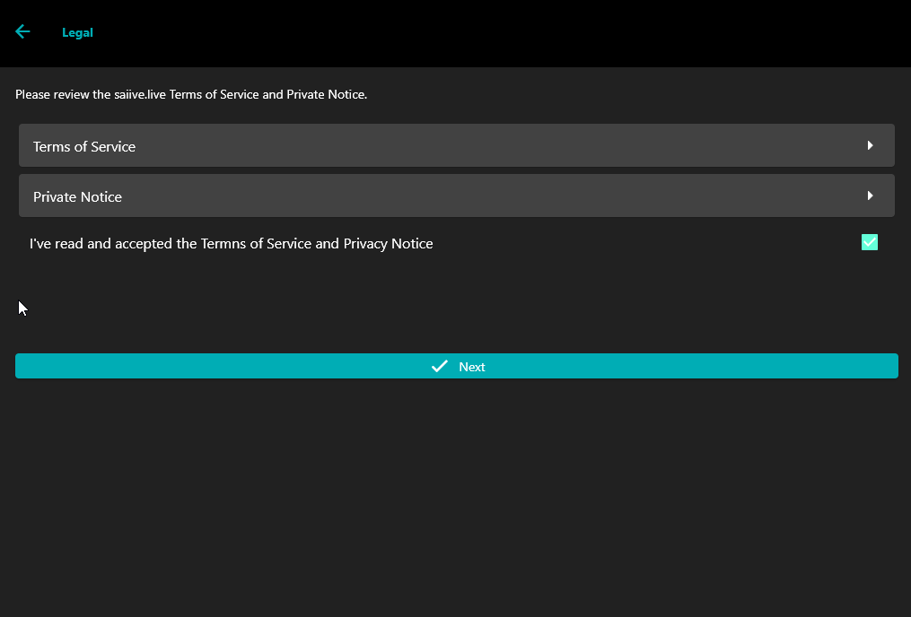

### 3. You have to enter your personal pin
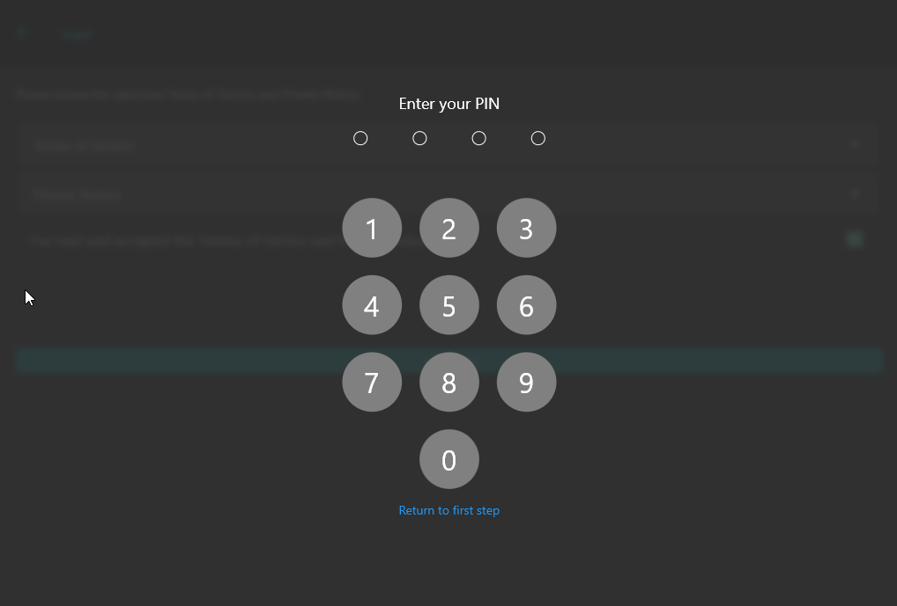

### 4. Click on "Reveal my recovery phrase" and write it down
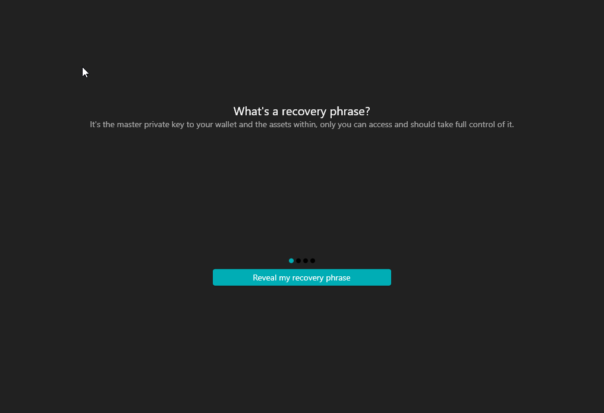

### 5. Click on "Details" and select "JellyfishBS"
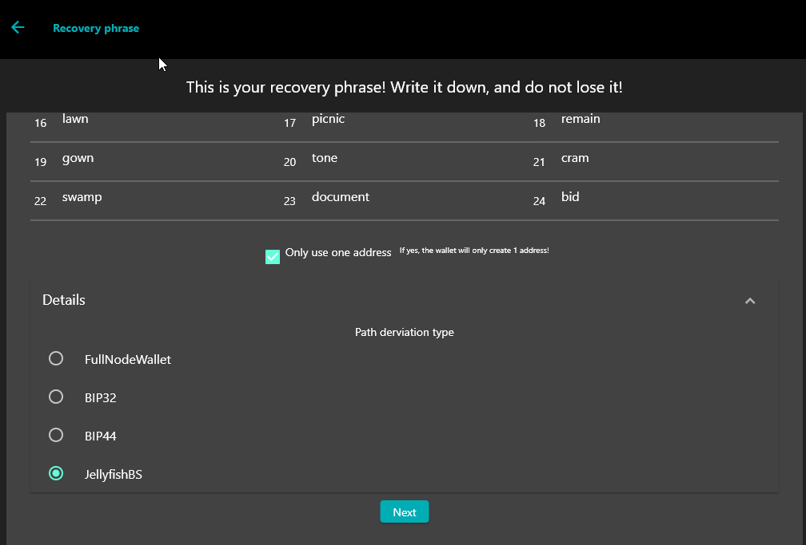

### 6. Confirm mnemonic seed
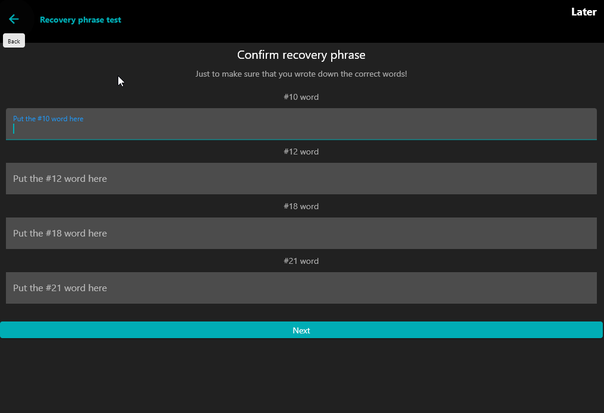

### 7. Wait till wallet is prepared
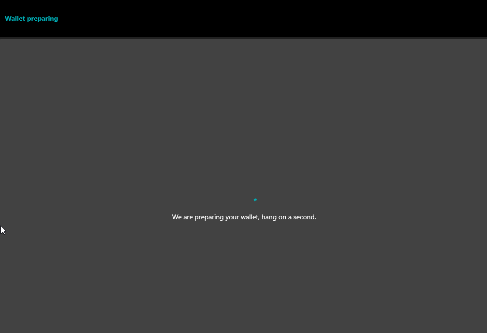

### 8. Click on settings in the upper right corner
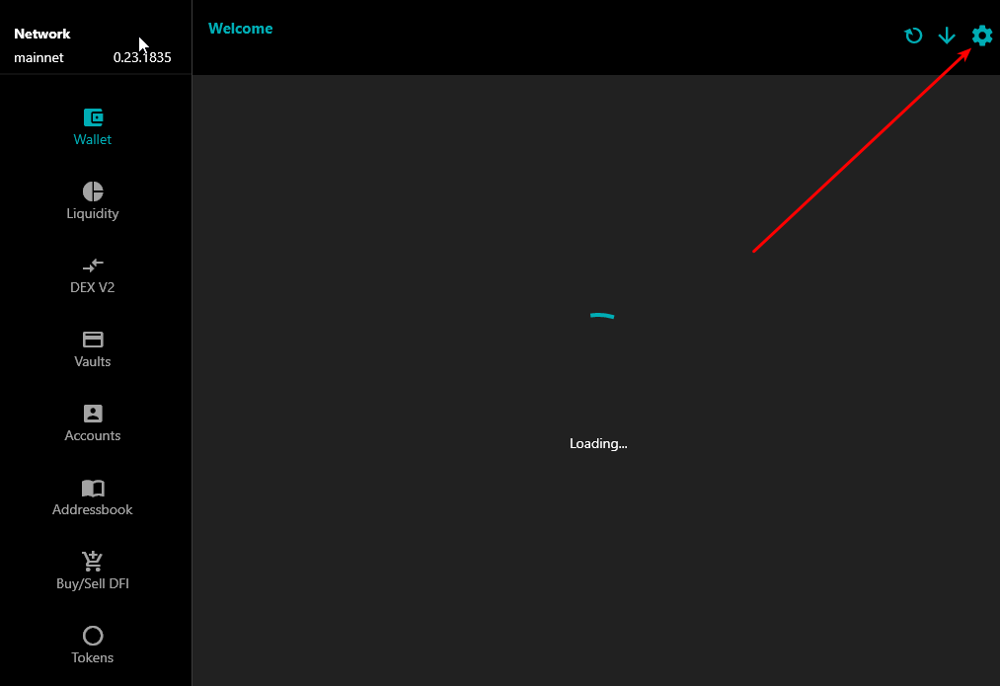

### 9. Scroll all the way down to "Expert address mode" and click on it
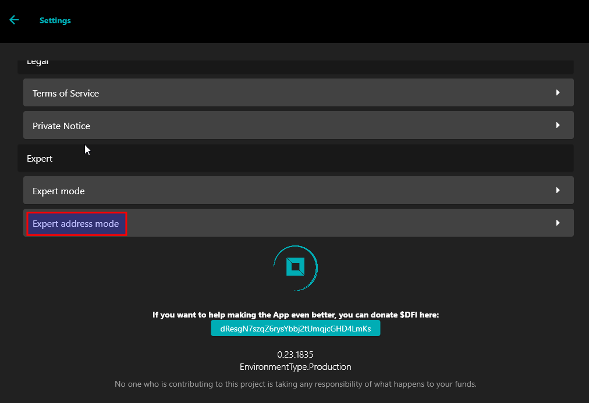
From now on you have to enter your personal pin for almost every of the following steps

### 10. Select Bech32 as your address type and click on "Generate" if you found the right address
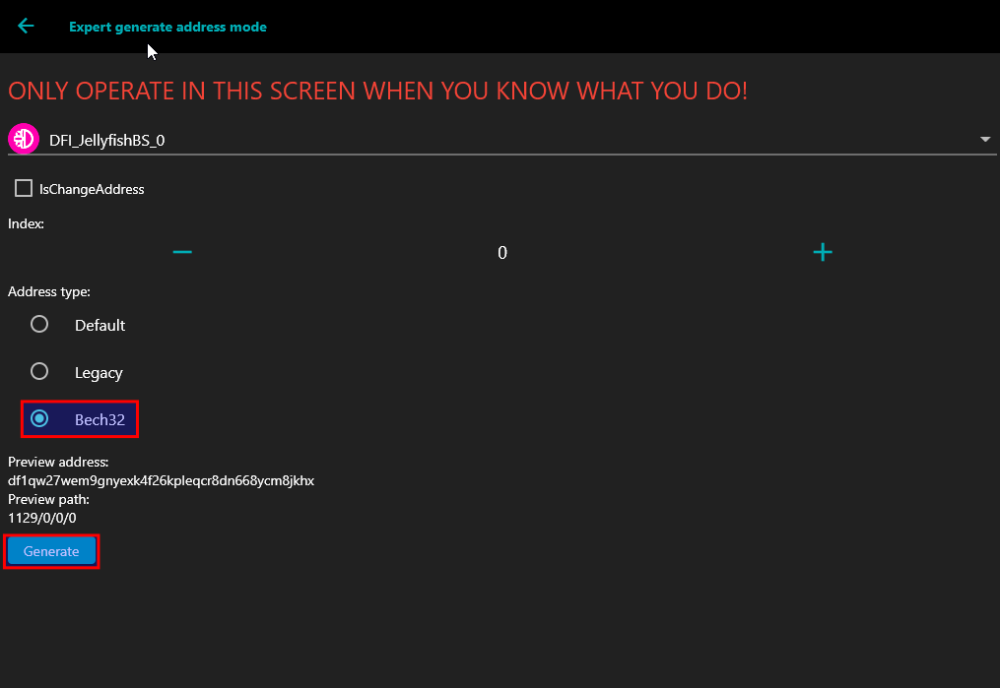

As of now, the address that is displayed should match the one in your Light Wallet.
By clicking on plus the next address can be shown to you.

When you have found the address from which you want to know the private key, click on "Generate".

### 11. Toggle "Expert Mode" and click on "Export private Key"
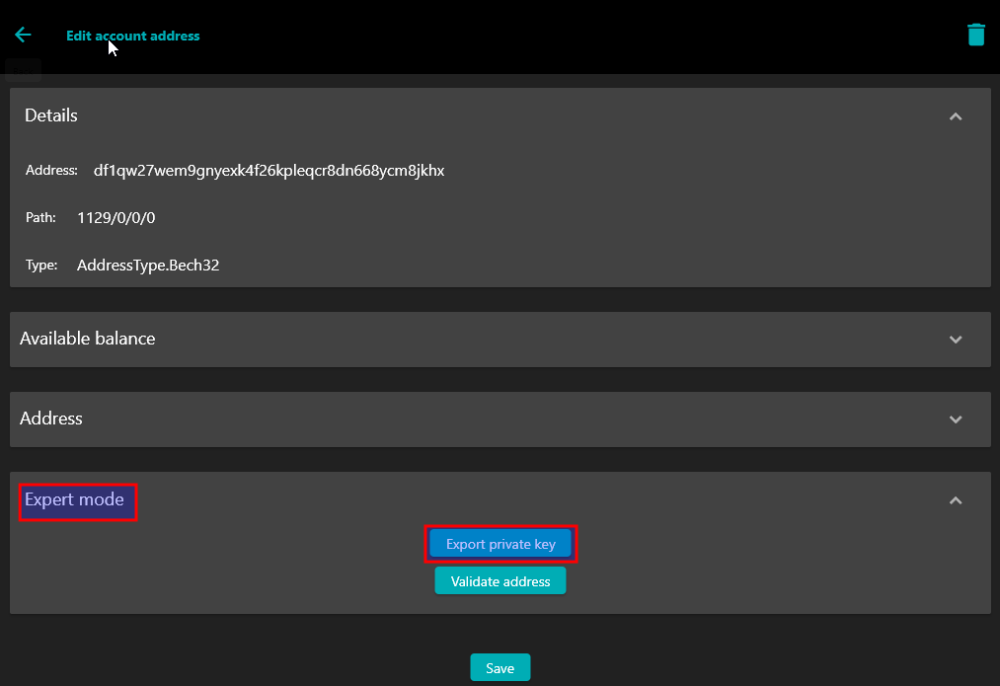

### 12. Click on "Display" and Copy your Private Key
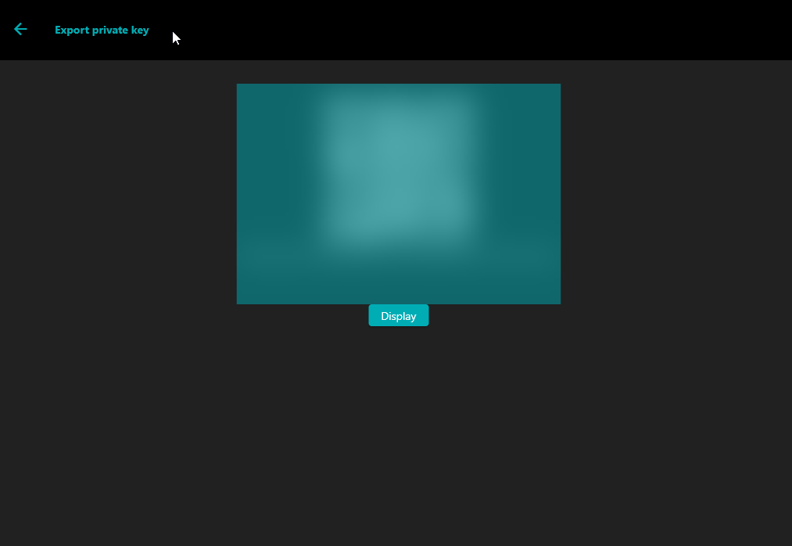

## Import the Private Key into your personal wallet

Use the CLI command "importprivkey" to import the private key of the selected address.
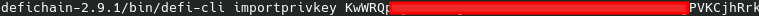

This will take a while...

## Disclaimer
- A private key gives an attacker access to all the assets located at the address
- make sure you keep the private key safe

THE INSTRUCTION IS PROVIDED “AS IS”, WITHOUT WARRANTY OF ANY KIND