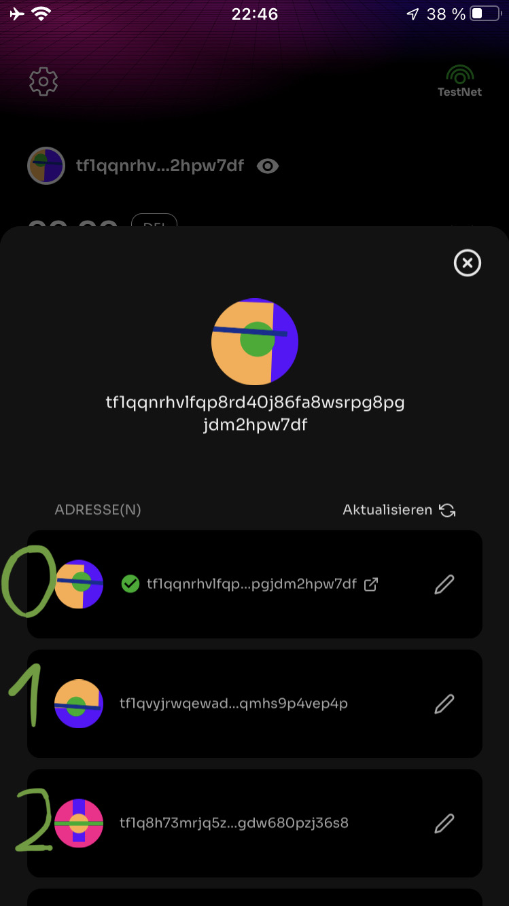

Basic Usage Of Transactions Builder
===================================

Introduction
------------

This is a short introduction to the creation of raw transactions using the Defichain Python library.
This explanation uses the defichain testnet. You can also use mainnet instead of the testnet.

.. admonition:: Disclaimer
    :class: caution

    Please be careful when using this software.
    It requires your private key, which gives access to all your assets.
    So if your computer is compromised, all your assets could be stolen.

    **If you do not know what you are doing, please do not use this software.**

    Also check the code before you use it, it can not be excluded that there is an error that leads to a total loss
    of funds.

    **Don’t Trust, Verify!**

General Information
-------------------

To use the raw transaction builder you should understand the following information:

Network
_______

The raw transaction implementation supports two networks of defichain: Mainnet, Testnet.
**Testnet is recommended to learn the functionality of raw transactions.**

Setup Testnet
~~~~~~~~~~~~~

You can use `mydefichain faucet <https://testnet-utxo.mydefichain.com/>`_ to fill up your testnet address with
1000 DFI.

For the simplicity of all involved I provide a mnemonic seed. On the first 10 testnet addresses are 50 UTXO
and 50 DFI tokens each.
Feel free to use them responsibly.

.. code-block:: text

    deputy army pluck artwork gallery supply bracket dilemma increase section silent coconut chimney auction ridge gravity cloth foot secret worry brother capital spread cheap

Address Types
_____________

The raw transaction implementation will support three address types:

- P2PKH (not yet implemented) -> "8FX8NeKa5WTSXmNzi2NdZNF8Vbyf3r1ujU"
- P2SH -> "dbhKc6up7r85EqAySeNQ8GbcrHcCpUP2w6"
- P2WPKH -> "df1qqnrhvlfqp8rd40j86fa8wsrpg8pgjdm2y35ddd"

(The addresses listed serve only as an illustration of the different address types on mainnet)

The defichain lightwallet uses the P2WPKH address.

Account
_______

An account describes one private key. Exactly one public key can be derived from this
private key. This public key then results in exactly one P2PKH, one P2SH and one P2WPKH address.

Example:

- Private Key: "2dc570673498c9e138336bd392a6971fe0996441d194947887ef0318d07b12da"

  - Public Key: "03a5c791ba2a9c2668fc10b095e742b971d7acd50ffa77d6b40b9974937cb6064e"

    - P2PKH: "8FX8NeKa5WTSXmNzi2NdZNF8Vbyf3r1ujU"
    - P2SH: "dbhKc6up7r85EqAySeNQ8GbcrHcCpUP2w6"
    - P2WPKH: "df1qqnrhvlfqp8rd40j86fa8wsrpg8pgjdm2y35ddd"

Wallet
______

A wallet contains a private seed from which an infinite number of accounts can be generated.
In case of the lightwallet the private seed will be derived from the mnemonic seed (24 words).

Example:

Installation
------------

Install the beta package from PyPi.

.. code-block:: python

    pip install defichain==3.0.0b3

Building Raw Transaction
------------------------

1. Dependencies
_______________

To be able to create transactions with the transaction builder some dependencies have to be created and then passed
to the builder.

1.1 Wallet
~~~~~~~~~~

Creating a testnet wallet with the mnemonic seed.

.. code-block:: python

    from defichain.networks import DefichainTestnet
    from defichain import Wallet

    MNEMONIC = "deputy army pluck artwork gallery supply bracket dilemma increase section silent coconut chimney auction ridge gravity cloth foot secret worry brother capital spread cheap"

    wallet = Wallet(DefichainTestnet)  # Initializing the wallet as a testnet wallet
    wallet.from_mnemonic(MNEMONIC)  # Setting the wallet mnemonic seed

1.2 Account
~~~~~~~~~~~

Derive the first account from the previously created wallet.

.. code-block:: python

    account = wallet.get_account(0)  # Extracting the first account of the wallet

1.3 Remote Data
~~~~~~~~~~~~~~~

Create the remote data source. The remote data source can either be :ref:`Ocean index` like shown in the example or a connection
to your own defichain node via :ref:`Node index`.

You can also use no data source. But then you have to provide the needed information (inputs) yourself.

.. code-block:: python

    from defichain import Ocean

    dataSource = Ocean(network="testnet")  # Initializing the remote data source -> testnet ocean

2. Transaction Builder
______________________

The :ref:`transaction builder <Transaction Builder TxBuilder>` is the hart of the hole implementation. It creates transactions for the specified address and
is thereby using the corresponding account to sign the transaction and the data source to query all needed data.

.. code-block:: python

    from defichain import TxBuilder

    builder = TxBuilder(address, account, dataSource, 1.0)  # Creating the transaction builder object

3. Build transaction
____________________

There are two different types of transactions:

3.1 UTXO
~~~~~~~~

There are native (UTXO) transactions. These transactions almost work like bitcoin transactions.
These transactions are only about sending UTXO DFI to a given address.

.. code-block:: python

    tx_sendall = builder.utxo.sendall(address)  # Sends all UTXO minus fee from the address specified in the builder object to the address specified as parameter

3.2 DefiTx
~~~~~~~~~~

There are defi transactions. These transactions are all transactions that distinguish defichain from bitcoin.
For example, there are UtxosToAccount, AccountToAccount, PoolSwap ...

.. code-block:: python

    tx_poolswap = builder.pool.poolswap(address, "DFI", 1, address, "BTC", 99.99999999)  # Create a poolswap transaction with the specified parameters

4. View the transaction
_______________________

The created transaction can be printed to the console in an easy to analyse format.

.. code-block:: python

    print(tx_poolswap)  # Prints the raw transaction in a deserialized format to the console

Output:

.. code-block:: json

    {
         "txid": "1fcbdcd1b18753fb24dcaeb259fffeb84123e29e04db688b37522fbe8ce49365",
         "hash": "21f16f151f688f222c380b27c95a594643794b4b51c136bbf0da42c34dfdf9db",
         "size": 283,
         "fee": 282,
         "version": 4,
         "marker": 0,
         "flag": 1,
         "inputs": [
              {
                   "inputType": "P2WPKH",
                   "txid": "1d9de1fb561fab9d7243d37c0b9308955bc777434e6f408a82f816da4cb40586",
                   "vout": 1,
                   "scriptSig": "",
                   "sequence": "ffffffff",
                   "address": "tf1qqnrhvlfqp8rd40j86fa8wsrpg8pgjdm2hpw7df",
                   "value": 4999999254,
                   "witness": {
                        "lengthSignature": 72,
                        "signature": "3045022100b11e61ff38835e09e5f4b4e5417808b99e1ddd3ccf792a60f929db22d3a93a2802203a3a69be756a4451e9461b1d795a13f0c837e104cc7081017c3dfd844529c21c01",
                        "lengthPublicKey": 33,
                        "publicKey": "03a5c791ba2a9c2668fc10b095e742b971d7acd50ffa77d6b40b9974937cb6064e"
                   }
              }
         ],
         "outputs": [
              {
                   "outputType": "defiTx",
                   "value": 0,
                   "defiTx": {
                        "defiTxType": {
                             "typeName": "OP_DEFI_TX_POOL_SWAP",
                             "typeHex": "73"
                        },
                        "addressFrom": "tf1qqnrhvlfqp8rd40j86fa8wsrpg8pgjdm2hpw7df",
                        "tokenFrom": 0,
                        "amountFrom": 100000000,
                        "addressTo": "tf1qqnrhvlfqp8rd40j86fa8wsrpg8pgjdm2hpw7df",
                        "tokenTo": 1,
                        "maxPrice": 9999999999
                   },
                   "script": "6a4c4d446654787316001404c7767d2009c6dabe47d27a77406141c289376a0000e1f5050000000016001404c7767d2009c6dabe47d27a77406141c289376a016300000000000000ffe0f50500000000",
                   "tokenId": 0
              },
              {
                   "outputType": "address",
                   "value": 4999998972,
                   "address": "tf1qqnrhvlfqp8rd40j86fa8wsrpg8pgjdm2hpw7df",
                   "script": "001404c7767d2009c6dabe47d27a77406141c289376a",
                   "tokenId": 0
              }
         ],
         "lockTime": 0,
         "serialized": "040000000001018605b44cda16f8828a406f4e4377c75b9508930b7cd343729dab1f56fbe19d1d0100000000ffffffff020000000000000000506a4c4d446654787316001404c7767d2009c6dabe47d27a77406141c289376a0000e1f5050000000016001404c7767d2009c6dabe47d27a77406141c289376a016300000000000000ffe0f5050000000000fced052a0100000016001404c7767d2009c6dabe47d27a77406141c289376a0002483045022100b11e61ff38835e09e5f4b4e5417808b99e1ddd3ccf792a60f929db22d3a93a2802203a3a69be756a4451e9461b1d795a13f0c837e104cc7081017c3dfd844529c21c012103a5c791ba2a9c2668fc10b095e742b971d7acd50ffa77d6b40b9974937cb6064e00000000"
    }

5. Send transaction
___________________

Using the builder with the given data source, the created transactions can then be easily submitted to the blockchain.

.. code-block:: python

    txid = builder.send_tx(tx_poolswap)  # Broadcasts the created transaction to the blockchain
    print(txid)  # prints the txid

>>> "1fcbdcd1b18753fb24dcaeb259fffeb84123e29e04db688b37522fbe8ce49365"

Full Code
---------

This code creates a poolswap transaction, signs it with the private key and broadcasts it to the testnet blockchain.

.. code-block:: python

    # Imports
    from defichain.networks import DefichainTestnet
    from defichain import Wallet
    from defichain import Ocean
    from defichain import TxBuilder

    MNEMONIC = "deputy army pluck artwork gallery supply bracket dilemma increase section silent coconut chimney auction ridge gravity cloth foot secret worry brother capital spread cheap"

    wallet = Wallet(DefichainTestnet)  # Initializing the wallet as a testnet wallet
    wallet.from_mnemonic(MNEMONIC)  # Setting the wallet mnemonic seed

    account = wallet.get_account(0)  # Extracting the first account of the wallet

    dataSource = Ocean(network="testnet")  # Initializing the remote data source -> testnet ocean

    address = account.get_p2wpkh()  # Extracting the P2WPKH address from the account

    builder = TxBuilder(address, account, dataSource, 1.0)  # Creating the transaction builder object

    tx_poolswap = builder.pool.poolswap(address, "DFI", 0.001, address, "BTC", 99.99999999)  # Create a poolswap transaction with the specified parameters

    print(tx_poolswap)  # Prints the raw transaction in a deserialized format to the console

    txid = builder.send_tx(tx_poolswap)  # Broadcasts the created transaction to the blockchain

    print(txid) # prints the txid
